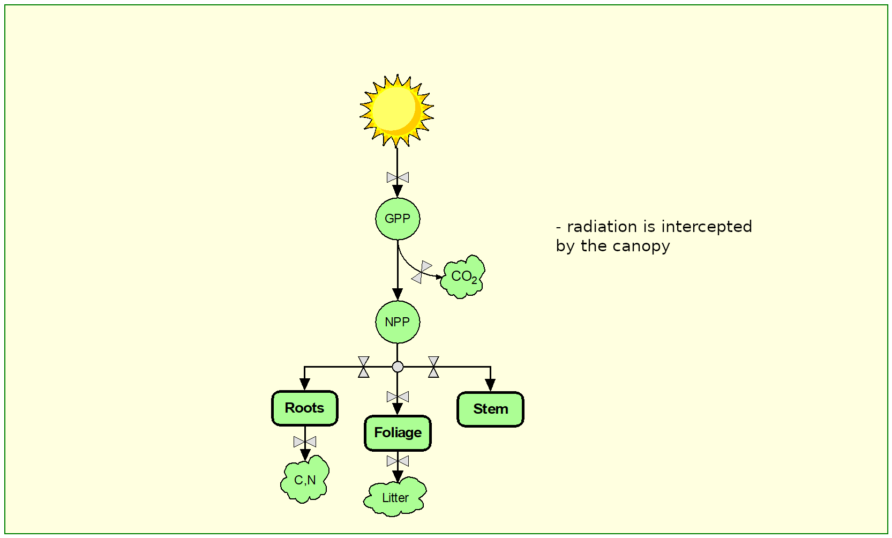
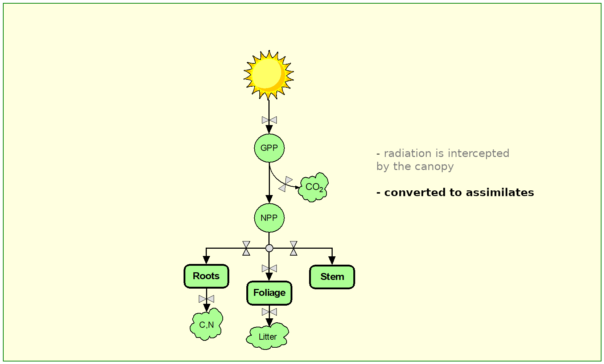

```{r packages, echo=FALSE, message=FALSE, warning=FALSE}
```

```{r setup, include=FALSE}
# R options
options(
  htmltools.dir.version = FALSE, # for blogdown
  show.signif.stars = FALSE,     # for regression output
  warm = 1
  )
# Set dpi and height for images
library(knitr)
opts_chunk$set(fig.height = 2.65, dpi = 300) 
# ggplot2 color palette with gray
color_palette <- list(gray = "#999999", 
                      salmon = "#E69F00", 
                      lightblue = "#56B4E9", 
                      green = "#009E73", 
                      yellow = "#F0E442", 
                      darkblue = "#0072B2", 
                      red = "#D55E00", 
                      purple = "#CC79A7")


```


# Model 3-PG: Introduction

.pull-left[
.footnote[Landsberg & Waring, 1997, ForEco]

]

.pull-right[
.center[.footnote[http://3pg.forestry.ubc.ca/]]

]

---
.pull-left[
.footnote[Island Press, 2014]

]

.pull-right[
.center[.footnote[Academic Press 2011]]
]

---
# Download 3-PG
]
]
]

---
# Model 3-PG: Introduction
</br>
- A tree growth model based on Physiological Principles that Predict Growth

- Bridges gap between mensuration-based growth & yield models and process-based, C-balance models 

- Provides dynamic predictions of biomass pools, stand attributes, stocking and soil water usage

- Applicable under changing conditions, "at the edges",  and to novel situations

- Maintains an admirable level of simplicity (at least reasonable)

---
# Model 3-PG: Introduction
]

---
# Model 3-PG: Introduction
]

---
# Comparison with empirical models

.pull-left[
### Advantages
- based on wide range of conditions
- applicable under changing conditions,*at the edges*, to novel situations
- provides explanation, aids understanding


### Disadvantages
- not as widely understood as empirical growth models
- not necessarily as accurate, either
- can require data not readily available
- not suitable for mixed forests
- works better with even-aged forests]

.pull-right[
.right[]
]

---

# Things to consider about a model

### Temporal and spatial scale
### State variables*
### Inputs
### Data availability
### Outputs
--
.left[.footnote[*A state variable is one of the set of variables that are used to describe the mathematical "state" of a dynamical system. Intuitively, the state of a system describes enough about the system to determine its future behaviour in the absence of any external forces affecting the system]]

---

# A quick summary of 3-PG


---
# Input data

.pull-left-wide[

###Climate data
- monthly mean temperature, radiation, rainfall, VPD
- observed or long-term average data

###Site & Soil descriptors
- latitude
- soil texture & water capacity
- fertility rating

###Stand initialisation data
- foliage, stem & root biomass
- stocking
- available soil water
]

.pull-left-wide-right[]

---

background-image:url("img/U4/3pg/3pg_conceptual.png")
# Conceptual model of forest growth

---
# Main components of 3-PG

</br>
.font120[
- **Production of biomass:** environmental modification of light use efficiency; constant ratio of NPP to GPP

- **Biomass allocation:** affected by growing conditions and tree size

- **Stem mortality:** probability of death; self-thinning

- **Soil water balance:** single soil layer model; evapo-transpiration determined from Penman-Monteith equation

- **Stand properties:** from biomass pools and assumptions about specific leaf area, branch+bark fraction, and wood density
]

---

background-image:url("img/U4/3pg/3pg_conceptual.png")
# Conceptual model of forest growth

---
# Causal loop in 3-PG


---

class:full-screen
background-image:url("img/U4/3pg/3pg_process_carbon balance.png")
# 3-PG is a carbon balance model
.tri-col-right[
</br></br></br></br></br></br></br></br>
* radiation is intercepted by the canopy
* converted to assimilates
]

.tri-col-left[
</br></br></br></br></br></br></br></br></br></br>
* allocated to foliage, stem & roots
* lost to respiration, litterfall & root turnover


]
.footnote[McMurtrie & Wolf (1983) model]
---

# 3-PG is a carbon balance model
.footnote[McMurtrie & Wolf (1983) model]


---

# Light interception

.tri-col-left[]
.tri-col-center[
- Light is absorbed as it passes through the canopy
- Intercepted radiation varies with LAI via Beer's law:
$$I = I_o(1-e^{k·LAI})$$
LAI determined by SLA and foliage biomass
]
    
.tri-col-right[


]

---

# 3-PG is a carbon balance model
.footnote[McMurtrie & Wolf (1983) model]

---
# Production & Solar radiation

.pull-left[
- Above-ground gross production linearly related to intercepted radiation
$$ P_g = \alpha_c(1-e^{-kL})Q_0$$

- Slope is a measure of **light use efficiency (LUE)** also known as *canopy quantum efficiency* denoted by $\alpha_c$

* .font80[annual stand-level LUE stable]
* .font80[Species-specific]
* .font80[Varies with climate and site factors through simple modifiers]
    

$$\alpha_c = f_T·f_F·f_N·min(f_D,f\theta)·f_{age}·\alpha_c$$


####.center[This finding is the basis for many simple growth models]
]

.pull-right[]


---
# Production: Net Primary Production (NPP)

.pull-left[- 3-PG assumes constant fraction (Y = 0.47) of GPP is lost as construction and maintenance respiration

- Net primary production is then
$$P_n = YP_g = \epsilon Y(1-e^{-kL})Q_o$$

- $Y$ probably varies seasonally with temperature
    - this would be an issue for a daily version of 3-PG
    ]
    
.pull-right[]

---

class: middle, inverse
layout: false

# Your turn!
<iframe src="https://giphy.com/embed/13awhIC2CcDaHC" width="480" height="336" frameBorder="0" class="giphy-embed" allowFullScreen></iframe>

---

class: full-screen
background-image:url("img/U4/3pg/3pg_process_carbon balance_text4.png")
# Allocation: Biomass partitioning

---
# Allocation: Biomass partitioning

NPP is paritioned into biomass pools (tDM·ha-1)
- foliage $W_F$
- aboveground woody tissue $W_S$
- roots $W_R$

Partitioning rates ( $\eta_F, \eta_R, \eta_S$) depend on site & growth conditions, and also on stand DBH

Litter-fall ( $\gamma_F$) and root-turnover ( $\gamma_R$)
 als taken into account.
 
Thus:

$$\Delta W_F = \eta_F P_n - \gamma_F W_F$$
$$\Delta W_R = \eta_R P_n - \gamma_R W_R$$
$$\Delta W_S = \eta_S P_n $$
---

# Allocation in 3-PG

A simple-minded approach reproduces well-established responses to site conditions

.pull-left-wide[]
.pull-left-wide-right[.font110[* root allocation determined by fertility & available soil water (ASW) -->
poor conditions favour below-ground growth

* foliage:stem allocation determined by tree size --> large trees have more allocation to stem wood]]

</br>
</br>

.center[Dynamic changes in allocation typically observed in thinning or pruning responses are not reproduced because allocation depends on tree size]


---

# Root allocation

Root allocation affected by growth conditions and by soil fertility

.pull-left[
$$\eta_R = \frac{\eta_{Rx}·\eta_{Rn}}{\eta_{Rn}+(\eta_{Rx}-\eta_{Rn})m\phi}$$
where:

$m = m_o + (1-m_0)FR$

$\eta_{Rx}$ = root allocation under poor conditions

$\eta_{Rn}$ = root allocation under optimal conditions]

.pull-right[]


---

# Foliage and stem allocation

Above-ground allocation is based on foliage:stem partitioning ratio

$$\rho_{FS} = \frac{\eta_F}{\eta_S} = a_pB^{n_p}$$
Increasing DBH decreases foliage allocation and increases stem allocation. 


.footnote[Waring et al 2016, For Ecol Manage]

---

# Litter-fall & root-turnover

**Litter-fall** an age-dependent fraction of foliage biomass

$$\gamma_F(t)=\frac{\gamma_{F_x}\gamma_{F_0}}{\gamma_{F_0} + (\gamma_{F_X}-\gamma_{F_0})e^{-kT}},  k = \frac{1}{t_{\gamma_F}}ln(1+\frac{\gamma_{F_X}}{\gamma_{F_0}})$$

.pull-left[
where:

$\gamma_{F_0}$ = litterfall rate at age 0

$\gamma_{F_X}$ = maximum litterfall rate (may be stress-related)

$t_{\gamma_F}$ = age when $\gamma_F = 0.5(\gamma_{F_0} + \gamma_{F_X})$
]

.pull-right[

]


**Root turnover** constant fraction of root biomass ( $\gamma_R$ = 0.015 month-1)

---

class:full-screen
background-image:url("img/U4/3pg/3pg_process_environmental.png")

# Site and environmental effects

</br>
Site & environmental factors affect growth via simple empirical modifiers


---

# Site and environmental effects

---
# Growth modifiers

---

# Growth modifiers
## Temperature growth modifier

---
# Growth modifiers
## Frost growth modifier

---
# Growth modifiers
## Soil water growth modifier

---
# Growth modifiers
## VPD growth modifier

---
# Growth modifiers
## Age-related growth modifier

---
# Growth modifiers
## CO2 growth modifier

---
# Growth modifiers


