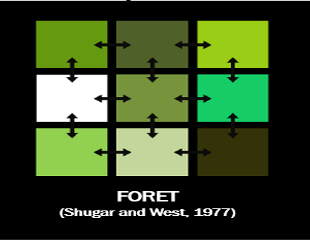

```{r packages, echo=FALSE, message=FALSE, warning=FALSE}
```

```{r setup, include=FALSE}
# R options
options(
  htmltools.dir.version = FALSE, # for blogdown
  show.signif.stars = FALSE,     # for regression output
  warm = 1
  )
# Set dpi and height for images
library(knitr)
opts_chunk$set(fig.height = 2.65, dpi = 300) 
# ggplot2 color palette with gray
color_palette <- list(gray = "#999999", 
                      salmon = "#E69F00", 
                      lightblue = "#56B4E9", 
                      green = "#009E73", 
                      yellow = "#F0E442", 
                      darkblue = "#0072B2", 
                      red = "#D55E00", 
                      purple = "#CC79A7")


```

layout: true
background-image:url("img/U5/barra_arbol.png")
background-size: contain
background-position: left

---

# Background/context


.right-column[

- Long-time interest of ecologists for **long-term dynamics** of forest ecosystems (Clements 1916, Gleason 1926, Whittaker 1953)

{{content}}
]
--

- Only in the 60s-70s there was enough **computing capability** to construct complex mathematical models
{{content}}

--

- The first attempts (1964-1969) were fully three-dimensional, individual-based tree models (3-D geometry of each individual crown, crown interactions, stem volume at various heights…)
{{content}} 
--
- 1972: JABOWA, first _gap model_ (Botkin et al. 1972) </br>
Stand structure and composition are the summary of births, deaths and growth of hundreds of **individual trees** --> individual-based models, but are *more simple* and mimic gap dynamics theory --> gap models

---

# Gap dynamics theory


.right-column[

* **Gaps:** small openings in a forest canopy (usually less than 1 ha)
{{content}}
]

--

* In temperate forests, gaps form at **0.5-2.0% per year**, due to natural mortality, windthrows, pests…
{{content}}

--

* Gap size <u>**varies**</u>, favouring species with different shade-tolerance
{{content}}

--
* Gaps provide micro-environmental conditions that allow the establishment of **shade intolerant species**. Allows to maintain their populations in mature or old-growth forests.
{{content}}

--

* Valid in several biomes: all?
{{content}}

--

##What do you think?

---
class:full-screen
background-image:url("img/U5/gap_BC.png")
background-size:cover

---
class:full-screen
background-image:url("")
background-size:cover

MATA DE VALENCIA!

---
class:inverse, left
background-image:url("img/U5/hubbard_forest.png")
background-size:cover

# JABOWA model (1972)


.pull-left[
{{content}}
]

--
</br></br></br></br>
- **Ja**nak, **Bo**tkin and **Wa**llis
{{content}}

--

- Collaboration between Hubbard Brook Experimental forest and IBM 
{{content}}

--

- Based on gap dynamics theory, makes a series of *assumptions*
{{content}}

--

- Is the basis of **<u>ALL gap models</u>**


---
layout:false 
class:font120
# JABOWA model (1972)

### Four basic assumptions

.pull-left-wide-right[


]

.pull-left-wide[{{content}}]

--
1. The forest stand is abstracted as a **composite of many patches**, each with different age and successional stage. Patch size so that one large individual can dominate the patch. For trees: 100-1000 m2
{{content}}
--
 
2. **Patches are horizontally homogeneous**, i.e. tree position within a patch is not considered. All tree crowns extend horizontally across the entire patch. 
{{content}}

--
3. The leaves of each tree are located in **an indefinitely thin layer (disk)** at the top of the tree.
{{content}}

--
4. Successional processes are described on each patch separately, i.e. there are **no interactions between patches**
{{content}}

---
class:font120
# JABOWA model (1972)
### Four basic assumptions

.pull-left-wide-right[


]

.pull-left-wide[{{content}}]

--

Assumes horizontal competition among individuals within a patch is **homogeneous**, but is spatially explicit in the **vertical dimension**

Simplification, but allowed for **mixed-age, mixed-species stands**


---
# JABOWA model (1972)

### Additional assumptions 


.pull-left-wide-right[


.footnote-right[https://www.danielbbotkin.com/jabowa/ </br>
30 days trial ($150 for license)]
]


.pull-left-wide[
.font90[
5) The entity modeled is the **individual**: establishment, growth and mortality of each individual is considered

6) Considers composition and structure, but **not functioning** (biogeochemical cycles, flows of water, photosynthesis…)

7) **Other life-forms** (shrubs, grasses) are **ignored**

8) Establishment comes from an **external list of potential colonists**
]
{{content}}]

--


---

# JABOWA model:quick summary

.center[]

---

layout:true
background-image:url("img/U5/growth.png")
background-size: 210px
background-position: right top

---

# JABOWA model: growth


.pull-extleft[Growth is modeled as a deterministic process, based on maximum posible growth, which is reduced by a series of scalars.

$$\frac{\Delta D}{\Delta t} = G·D·(1-\frac{D·H}{D_{max}·H_{max}})·\frac{1}{b(D)}·f(e)$$

]

.pull-left[
where:
* $D$ is diameter
* $H$ is tree height (allometric function of D) 
* $G$ is max. Relative Growth rate 
* $b(D)$ is a function encapsulating the allometric relationship
* $D_{max}$ and Hmax are maximum tree size
]

.pull-right[{{content}}]
--


---

# JABOWA model: growth reductors (I)

.pull-extleft[Optimal growth is reduced based on three scalars [0-1]

$$f(e) = g_1(AL)·g_2(SBAR)·g_3(DD)$$

.tri-col-left[.right[]]
.tri-col-center[.right[]]
.tri-col-right[] $.$

.font90[ $g_1(AL)$ is a function of available light 

$g_2(SBAR)$ is a function of stand basal area 

$g_3(DD)$ is a function of temperature (annual degree-day sum)]]


.pull-extleft[

.font90[{{content}}]]
--
* The only resource for which there is explicit competition is light
{{content}}
--
* Belowground resources are summarized in the SBAR factor
{{content}}

--
* Drought not explicitly modeled (not important in New Hampshire)


---
layout: false
# JABOWA model: growth reductors (II)


.tri-col-left[
#### Light availability factor
Height as allometric function of D (parabollic)
]

.tri-col-center[

]

.tri-col-right[]


---
# JABOWA model: growth reductors (II)

.tri-col-left[
#### Light availability factor
Height as allometric function of D (parabollic)

LAI is calculated via a simple allometric relationship to diameter 
$$	LAI = cD^2/k$$


]

.tri-col-center[

]

.tri-col-right[

]

---

# JABOWA model: growth reductors (II)

.tri-col-left[
#### Light availability factor

Height as allometric function of D (parabollic)

LAI is calculated via a simple allometric relationship to diameter 
$$	LAI = cD^2/k$$

Light extinction is predicted using the Beer-Lambert law.
]

.tri-col-center[


]

.tri-col-right[

]
---

# JABOWA model: growth reductors (II)

.tri-col-left[
#### Light availability factor
Height as allometric function of D (parabollic)

LAI is calculated via a simple allometric relationship to diameter 
$$	LAI = cD^2/k$$

Light extinction is predicted using the Beer-Lambert law
]

.tri-col-center[


]

.tri-col-right[


]
---

# JABOWA model: growth reductors (II)

.tri-col-left[
#### Light availability factor
Height as allometric function of D (parabollic)

LAI is calculated via a simple allometric relationship to diameter 
$$	LAI = cD^2/k$$

Light extinction is predicted using the Beer-Lambert law

#### BUT...

]

.tri-col-center[


]

.tri-col-right[


]


.pull-left[.font90[
* No asymptotic height allometry
* LAI should not increase indefinitely but reach a plateau
* All leaves are at tree top (no overlap)
]]


---

# JABOWA model: growth reductors (II)

.tri-col-left[
#### Light availability factor
Height as allometric function of D (parabollic)

LAI is calculated via a simple allometric relationship to diameter 
$$	LAI = cD^2/k$$

Light extinction is predicted using the Beer-Lambert law

#### BUT...

]

.tri-col-center[


]

.tri-col-right[


]


.pull-left[.font90[
* No asymptotic height allometry
* LAI should not increase indefinitely but reach a plateau
* All leaves are at tree top (no overlap)
]]

.pull-right[
So… JABOWA **overestimates** the amount of shade cast by large trees, inflating their <u>competitive strength
</u>]

---

# JABOWA model: growth reductors (III)


### Basal area factor

.pull-left-wide[
* Basal area integrates other resources for which trees compete (water, nutrients)

* Growth decreases linearly with basal area (not species-specific)
]
.pull-left-wide-right[]

---

# JABOWA model: growth reductors (III)


### Basal area factor

.pull-left-wide[
* Basal area integrates other resources for which trees compete (water, nutrients)

* Growth decreases linearly with basal area (not species-specific)

]

.pull-left-wide-right[]

### Temperature factor
.pull-left-wide[
* Sum of degree days serves as an index of available energy for plant growth

* Uses a parabollic relationship

* This equation has been widely used in gap models but is <u>heavily criticized</u>

]

.pull-left-wide-right[]

---

# JABOWA model: growth reductors (III)


### Basal area factor

.pull-left-wide[
* Basal area integrates other resources for which trees compete (water, nutrients)

* Growth decreases linearly with basal area (not species-specific)

]

.pull-left-wide-right[]

### Temperature factor
.pull-left-wide[
* Sum of degree days serves as an index of available energy for plant growth

* Uses a parabollic relationship

* This equation has been widely used in gap models but is <u>heavily criticized</u>

]

.pull-left-wide-right[]

---
background-image:url("img/U5/recruitment.png")
background-size:150px
background-position:right top

# JABOWA model: establishment

.pull-extleft[
* No interactions between patches, so assumes all tree species are present in each patch (100 m2)
* New trees are added based on three criteria (3-D regeneration niche):
    
.font80[
    * Light availabily at the floor must be > species-specific threshold
* Annual sum of eavapotranspiration must be > species-specific threshold
* Annual sum of degree days (DD) must lie within a range tolerated by the species
]
]


.pull-left[
* Number of trees is random within ranges:
    * 0-200 for shade tolerants
    * 0-1300 for mid-tolerants
    * 6000-7500 for shade intolerants

* Tree size at establishment is 0.5 cm (not seedling stage)
]

.pull-right[]


---
background-image:url("img/U5/mortality.png")
background-size: 200px
background-position:right top

# JABOWA model: mortality

.pull-extleft[
* Stochastic process with two components
    * **Background mortality:** (2% of trees reach maximum tree size)   
    * **Stress-related mortality:** acts when growth < 0.01 cm/year (not species-specific)]


---

# JABOWA model: conclusions

.pull-left[.font90[
* Very simple model, still useful

* **<u>ALL gap models</u>** are direct descendants of JABOWA
* Almost all the assumptions have been challenged, scrutinized or **<u>replaced**</u> --> large variety of gap models
]]
--
.pull-right[]
--

---
background-image:url("img/U5/gap_models_tree.png")
background-size: 350px
background-position: right bottom

# Gap models: FORET (1977)

.pull-left-wide-right[
]
.pull-left-wide[{{content}}]

--
* Still assumes that the forest can be divided into small (typically the size of a large canopy tree) cells. 
{{content}}
--

* The most recent versions include the effects of local competition among cells.
{{content}}
--
* New seedlings are produced by the adult trees on the landscape (prop. to abundance)
{{content}}

--
* However, these seedlings are often dispersed globally (non-spatial)

---

# Variations in assumptions in gap models

.pull-left[.font90[
* **Forest as a mosaic of patches:** all gap models but SORTIE-ND

* **Horizontal structure within a patch:** almost all gap models retain this assumption. Patch size usually not so important, but causes problems when photosynthesis and respiration are added (model 4C; solved using estimates of crown projection area)
]]

.pull-right[
]
---

# Variations in assumptions in gap models

.pull-left[.font90[
* **Forest as a mosaic of patches:** all gap models but SORTIE-ND

* **Horizontal structure within a patch:** almost all gap models retain this assumption. Patch size usually not so important, but causes problems when photosynthesis and respiration are added (model 4C; solved using estimates of crown projection area)

* **All leaves are at the top of the tree:** several alternatives have been tried

   .font90[ * FORSKA: adds two state variables (crown height and leaf area from pipe model) --> crown overlap, leads to family of based models. FORSKA >> ZELIG in Picea-Pinus

* SORTIE: further sophistication, includes individual tree crowns and transmissivity]
]
]

.pull-right[

.pull-left[]
.pull-right[
</br>
</br>
]
]
---

class:font100
background-image:url("img/U5/gap_poster.png")
background-size:450px
background-position:right top

# Variations in assumptions in gap models

.pull-left[
**Relationships between patches:**
* ZELIG (Urban, 1990); newer versions of FORET 
* PICUS and SORTIE add seed dispersal
* SORTIE-ND (2005): spatially-explicit, individual-based competition
]

.pull-right[
]

.pull-left-wide[{{content}}]

--
**Entities being modelled:**
* Modelling all trees is time-consuming, and since growth is deterministic…

--

* ForClim (Bugmann, 1996) introduces the use of cohorts. All trees established a year are identical (simulation time ¼){{content}}
--

* Further simplifications: 
    * Few size classes (FLAM, FORMIX)
    * use of functional types instead of species
    * Statistical simplification: Markov chains (probability between states; MOSAIC) or partial differential equations (DisCForM)

--

**Ecosystem structure and function**
* 
Recently, gap modelers try to go beyond structure and function (photoshynthesis, carbon balance): physiology-based gap models 4C, HYBRID and FIRE-BGC were the first, but then many models
]

.pull-left-wide-right[

]

---
# Variations in processes

.pull-extleft[.small[
**GROWTH**
* Different allometric relationships
* Less simplistic allocation
* Competition for light similar to JABOWA
* Competition for other resources generally not included except in physiology-based models 
* Change parabolic temperature effect for asymptotic

**ESTABLISHMENT:** tended to high diversity in each patch and low across patches
* First improvement: seed availability depends on presence of mature trees
* Second improvement: horizontal relationships between patches are considered
* Most still use filters to define n-dimensional regeneration space

**MORTALITY**
* Most models use stochastic “background” mortality
* Stress-related mortality is used in all models, but the definition of “stress” varies
* Clear trend to include disturbance-related mortality: pests, fires, windthrow, **HARVEST!!!!**
]
]

.pull-extleft-right[

</br></br>
</br>


</br>
</br>

]

---
# The dynamics of gap models: variations in assumptions through time

### From simplicity to complexity… and back


---
# The dynamics of gap models: variations in assumptions through time

### From simplicity to complexity… and back


---
# Implications and limitations of gap models

Gap models simulate long-term population dynamics - which are slow – on small patches and with several stochastic processes.

--

1. The stochasticity makes **a single simulation of little interest**. Standard: several runs and statistical treatments (average, median, <u>sd, kurtosis</u>…) --> *less practical*

--

2. **Few data sources to initialize stands** due to the smaller scale of most measurements. Standard practice to initialize from “bare ground” and wait for dynamics to stabilize (~400-800 years). Gap models mostly used to simulate secondary succession --> *less practical*

--

3. This raises the limitation on **climatic data availability** for such long series. 

--

4. **Difficult to validate**, due to limitations in the comparability. No forest will have gone through exactly the same processes (**management!!**). <u>Model evaluation</u> more used than proper validation ->*importance of long-term data!*

--

5. Original models **not valid to assess effects of climate change**. Newer versions are much better, include some physiology->*but number of parameters!!!*

---

# Examples of Gap Models

.pull-left[
## FORCLIM (1986)
* Inclusion of cohorts (groups of trees with same age and diameter)– smaller patches

* Establishment, growth, competition and mortality in each patch

* Assumes no interaction between patches, forest succession in a patch is independent on neighbor patches

* PLANT, WEATHER, WATER, MANAGEMENT (Mechanistic hydrology)
]

.pull-right[


]

---

# Examples of Gap Models


.pull-left[
## SORTIE-ND (1995,2005)

* All trees are simulated

* Position of each tree is defined, competition by individual neighbors

* Allows simulation of complex, mixed-species stands

* Allows complex management systems

* Several dozens of behaviors (growth, mortality, dispersal, browsing) and equations
]

.pull-right[


]
---

# To know more

* Bugmann, H., 2001. A review of forest gap models. Climatic Change 51, 259–305.

* Fontes, L., Bontemps, J.-D., Bugmann, H., Van Oijen, M., Gracia, C., Kramer, K., Lindner, M., Rötzer, T., Skovsgaard, J.P., 2011. Models for supporting forest management in a changing environment. Forest Systems 3, 8. 

* Larocque, G.R., Shugart, H.H., Xi, W., Holm, J.A., 2016. Forest Succession Models 43.

* Liu, J., Ashton, P.S., 1995. Individual-based simulation models for forest succession and management. Forest Ecology and Management 73, 157–175

* Porté, A., Bartelink, H.H., 2002. Modelling mixed forest growth: a review of models for forest management. Ecological Modelling 150, 141–188. 

* Shugart, H.H., Wang, B., Fischer, R., Ma, J., Fang, J., Yan, X., Huth, A., Armstrong, A.H., 2018. Gap models and their individual-based relatives in the assessment of the consequences of global change. Environmental Research Letters 13, 033001. 


